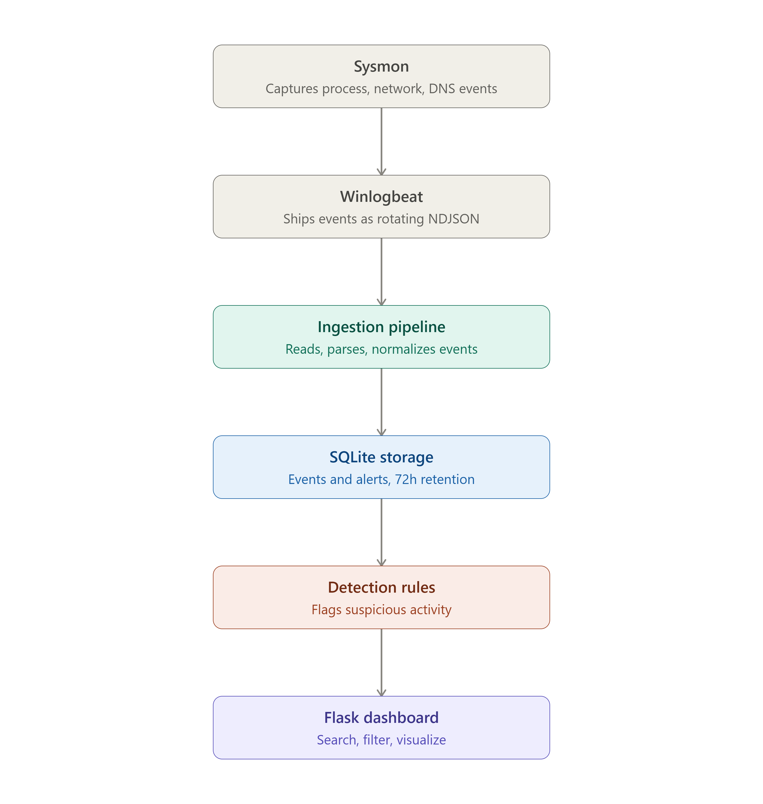
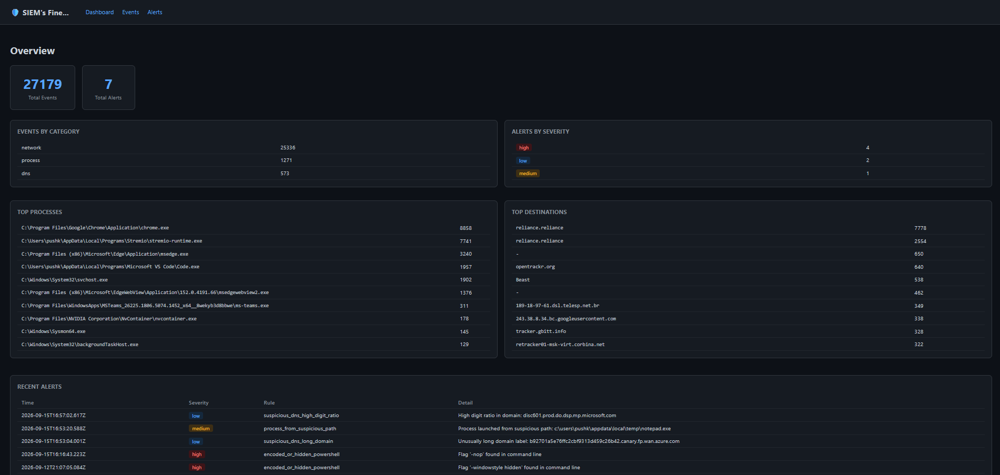
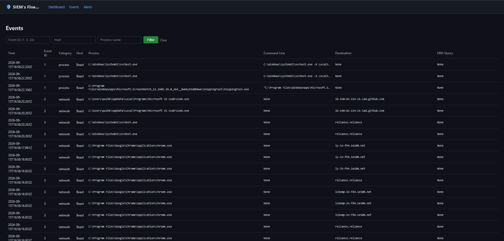
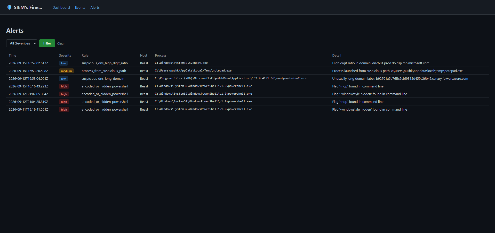

# SIEMs Fine... — Sysmon-Based Detection Pipeline

A self-built mini-SIEM for my personal machine, built to understand how 
log pipelines, normalization, and detection engineering actually work 
under the hood — not just from the analyst seat looking at a vendor UI.

> **Note:** This repo is a project showcase (README + screenshots only). 
> Source code is kept private.

---

## What it does

Collects Windows endpoint telemetry via Sysmon, parses and normalizes it 
into a consistent schema, runs it through custom detection rules, and 
surfaces searchable events + alerts through a dashboard.

**Pipeline:**
Sysmon → Winlogbeat (NDJSON) → Log Reader → Parser → Normalizer → SQLite (events + alerts) → Detection Rules → Flask Dashboard

---

## Detections implemented

| Rule | What it catches | Why it matters |
|---|---|---|
| Suspicious parent-child process | Office/browser apps spawning powershell/cmd/wscript | Classic macro-abuse / initial access pattern |
| Hidden/encoded PowerShell | `-windowstyle hidden`, `-enc`, `-nop` flags | Common in fileless malware & LOTL techniques |
| Suspicious execution path | Processes launched from Temp/AppData/Downloads | Typical malware drop locations |
| Unresolved IP on uncommon port | Network connections with no hostname, non-standard port | Possible C2 or unusual tooling |
| DGA-like DNS queries | Long/high-digit-ratio domain labels | Indicator of DGA-based C2 beaconing |

---

## Screenshots

**Dashboard — live event & alert overview**

**Events — searchable, filterable log table**

**Alerts — triggered detections by severity**

---

## What I learned

Most of the real learning came from things breaking:

- **False positive tuning** — my DNS detection rule initially flagged every 
  Windows reverse-DNS (PTR) lookup and short legitimate subdomains like 
  `v10.events.data.microsoft.com` as suspicious. Fixing this meant 
  actually understanding what "normal" traffic looks like before trying 
  to flag "abnormal" — the same tuning work a SOC analyst does constantly 
  to keep signal-to-noise usable.

- **Log rotation edge case** — my log reader picked the "newest" file by 
  sorting filenames alphabetically, which silently broke because 
  Winlogbeat's rotation sequence numbers aren't zero-padded (`...-9` sorts 
  after `...-24` alphabetically). This caused real alerts to go undetected 
  for hours before I traced it — a good reminder that pipeline reliability 
  issues can look identical to "no threats found," which is a dangerous 
  failure mode for any monitoring system.

- Building the normalization layer from scratch gave me a much clearer 
  picture of *why* correlation across log sources is hard, and what a 
  SIEM is actually doing when it makes disparate event types queryable 
  in one place.

---

## Roadmap

- [ ] Honeypot integration for real attacker telemetry
- [ ] SOAR-style automated response actions (isolate host, kill process)
- [ ] MITRE ATT&CK technique mapping for detection coverage
- [ ] Additional log sources (Windows Security Event Log, firewall logs)

---

## Stack

Python · Sysmon · Winlogbeat · SQLite · Flask
